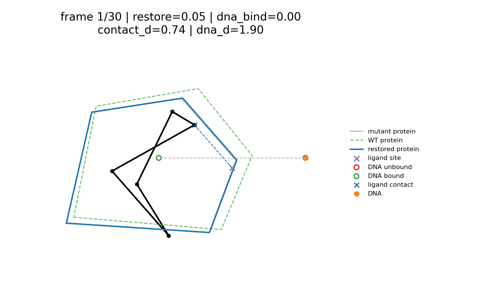

# Restoration Analogue In PolyDiff

This document explains the restoration setup implemented in PolyDiff after the proxy was revised to match the intended story more faithfully.

## One-Sentence Summary

The restoration analogue is:

- generate a ligand-like polygon
- make it bind a mutant protein at a chosen site
- let that binding restore the same protein toward a WT-like state
- let DNA binding become possible only because the protein has been restored

So the terminal objective is not "ligand fits pocket." The terminal objective is "ligand binding rescues protein function enough that DNA can bind."

## The Three Bodies

The toy scene has three entities:

1. `Mutant protein`
   This is the fixed defect-bearing target geometry.

2. `Generated polygon`
   This is the diffused sample. In the analogy it is the ligand candidate.

3. `DNA body`
   This is the downstream functional partner. It has an unbound reference position and a bound reference position.

That means the model is not asking whether the ligand directly moves DNA. It is asking whether ligand contact restores the protein enough that DNA binding becomes available again.

## Why This Version Is More Faithful

The earlier shortcut model was:

```text
ligand contact -> DNA moves
```

That was useful as an "external effect" toy, but it skipped the mechanistic middle step you actually care about.

The current proxy is:

```text
ligand contact -> protein restoration -> DNA-binding competence -> DNA bound pose
```

This matters because your biological claim is:

- the ligand binds the mutant protein
- that same protein becomes WT-like in function
- then the protein can bind DNA

The revised proxy now encodes that sequence explicitly.

## What The GIF Is Showing

The restoration GIF overlay now uses this visual language:

- gray outline: fixed mutant protein reference
- green dashed outline: WT-like protein reference
- blue outline: current restored-protein state implied by the ligand contact
- black polygon: generated ligand trajectory
- purple `x`: configured ligand-binding site on the protein
- blue `x`: current differentiable ligand contact point
- blue dashed line: contact error relative to the binding site
- red circle: DNA unbound reference
- green circle: DNA bound reference
- orange point: current DNA position implied by the restored-protein state

The title fields mean:

- `restore`: current protein-restoration score
- `dna_bind`: current DNA-binding competence
- `contact_d`: ligand-contact error at the binding site
- `dna_d`: distance from the current DNA position to the bound reference

Read it this way:

- lower `contact_d` is better
- higher `restore` is better
- higher `dna_bind` is better
- lower `dna_d` is better

## The Exact Proxy Used In Code

The implementation lives in [`polydiff/restoration.py`](../polydiff/restoration.py).

### 1. Scene Anchoring

The diffusion model learns polygon shape, not a meaningful global pose. Before restoration is evaluated, each polygon is anchored into a fixed scene:

```text
x_scene = x - mean(x) + scene_anchor
```

where `scene_anchor` is the centroid of the configured mutant protein points.

Without this step, raw translation noise would masquerade as "binding" or "flying away," which is not a meaningful signal in this toy setup.

### 2. Soft Ligand Contact

Given scene-anchored ligand vertices `v_i` and the configured binding site `b`, the code builds differentiable soft contact weights:

```text
w_i = softmax( -beta * ||v_i - b||^2 )
```

and a soft contact point:

```text
c(x) = sum_i w_i v_i
```

This is a differentiable proxy for "which part of the ligand is engaging the mutant pocket site?"

### 3. Protein Restoration Score

The contact point is compared with the ideal binding site:

```text
contact_drift(x) = ||c(x) - b||
```

and converted into a restoration score:

```text
R(x) = exp( -contact_drift(x)^2 / (2 sigma^2) )
```

So:

- good contact gives `R(x)` near `1`
- poor contact gives `R(x)` near `0`

This is the explicit "protein restored by ligand binding" state variable that the previous version lacked.

### 4. Protein Geometry Interpolation

The protein itself is then moved between mutant and WT-like reference geometries:

```text
P_protein(x) = P_mutant + R(x) * (P_WT - P_mutant)
```

That is why the overlay now shows a dynamic blue protein outline rather than only a static mutant outline.

This is still a toy proxy, but it makes the restoration claim visible: the protein is what changes first.

### 5. DNA-Binding Competence

DNA binding is not turned on directly by contact. It is turned on by the restored-protein state:

```text
B(x) = sigmoid( (R(x) - threshold) * steepness )
```

This gives a soft version of:

- below a restoration threshold, the protein is still mostly DNA-incompetent
- above that threshold, DNA binding becomes available

### 6. DNA Position

The DNA body then moves between its unbound and bound reference positions:

```text
P_DNA(x) = P_unbound + B(x) * (P_bound - P_unbound)
```

This means:

- if the protein is not restored, DNA stays near the unbound pose
- if the protein is restored, DNA moves toward the bound pose

The important causal point is that DNA is downstream of the protein-restoration state, not downstream of raw ligand contact alone.

### 7. Restoration Objective

The restoration guidance objective minimizes DNA mis-binding distance:

```text
J(x) = ||P_DNA(x) - P_bound||^2
```

During reverse diffusion, the sampler uses the gradient of `-J(x)` with respect to the ligand coordinates.

So restoration guidance asks for ligand shapes whose contact pattern restores the protein enough to enable DNA binding.

## What Reverse Diffusion Is Actually Optimizing

The denoiser still performs ordinary DDPM denoising. Restoration adds an extra gradient term to the reverse mean:

```text
model_mean <- model_mean + posterior_variance_t * guidance_grad(x_t, t)
```

For restoration guidance, that gradient comes from the DNA-distance objective above. Because the full proxy is differentiable in PyTorch, the error signal flows:

```text
DNA distance -> DNA-binding activation -> protein restoration -> contact point -> ligand vertices
```

That is why the model can still use the same generic sampler interface as regularity or area guidance.

In the current sampler, restoration guidance is also weighted by reverse-diffusion timestep. Early noisy steps get only a small fraction of the configured restoration strength, and late steps get the full strength. This keeps the restoration proxy from overreacting to raw Gaussian noise at the start of sampling.

## Why Regularity Is Still Useful

Restoration guidance only says:

- find ligand geometries that produce the rescue effect

It does not guarantee the resulting polygon still looks like a plausible training-distribution sample.

That is why the config often combines:

- `restoration`
- `regularity`

The intended split is:

- `restoration` pushes the ligand toward rescue-relevant contact geometry
- `regularity` discourages degenerate polygon solutions

## How To Read The Diagnostics JSON

When restoration is enabled, sampling diagnostics include:

- `restoration_config`
- `restoration_summary`
- `restoration_trajectory`

The most useful fields in `restoration_summary` are:

- `protein_restoration_mean`
  Average restored-protein score across the final sample batch.

- `dna_binding_activation_mean`
  Average DNA-binding competence implied by the restored-protein state.

- `contact_drift_mean`
  Average ligand-contact error relative to the configured binding site.

- `dna_distance_mean`
  Average distance from the current DNA position to the bound reference.

- `restoration_success_rate`
  Fraction of samples whose final `dna_distance` is at or below `success_distance`.

The trajectory payload records the same quantities across reverse diffusion. If guidance is working, you want to see:

- `protein_restoration_mean` rise
- `dna_binding_activation_mean` rise
- `contact_drift_mean` fall
- `dna_distance_mean` fall

Backward-compatible legacy keys such as `activation_mean` and `secondary_body_distance_mean` are still emitted for older analysis code, but the new names are the ones that match the revised model.

## What The Idealized GIF Demonstrates

The following GIF is not sampled from the model. It is a hardcoded illustration of the behavior the proxy is meant to reward:



In the idealized trajectory:

- one part of the ligand moves toward the configured binding site
- the blue protein outline morphs from the gray mutant reference toward the green WT-like reference
- `restore` increases
- `dna_bind` increases after protein restoration rises
- the orange DNA point moves from the red unbound reference toward the green bound reference

That is the faithful toy interpretation of "restoration working" in this project.

## How To Read Real Sampled GIFs

Real sampled trajectories will usually look noisier than the idealized one because the model is solving several things at once:

- denoising from Gaussian noise
- staying on the learned polygon distribution
- finding rescue-relevant contact geometry
- optionally satisfying regularity guidance too

So the idealized GIF should be read as:

- "this is the behavior the proxy rewards"

not:

- "this is exactly how every successful sample will look"

## What This Toy Setup Is Not

This is still not a physically faithful molecular-restoration simulator.

Important limitations:

- The protein is 2D geometry, not a flexible 3D structure.
- The ligand is a polygon, not a chemical graph with real interactions.
- The restored-protein state is a hand-built scalar proxy, not a learned mechanistic state.
- DNA binding is a smooth interpolation between two reference positions, not full docking or dynamics.
- Scene anchoring is imposed because the generative model does not learn a calibrated global pose distribution.

So the correct claim is:

- this is a toy rescue objective with an explicit causal middle step

not:

- this is a realistic molecular restoration model

## Best Interpretation

The best way to think about the current restoration analogue is:

- the mutant protein defines a defect-bearing environment
- the polygon proposes a ligand-like intervention
- contact at the right site restores the protein toward a WT-like state
- that restored state re-enables DNA binding

If a polygon scores well, the project is saying:

- "this sample solved the toy rescue proxy"

It is not saying:

- "this is a validated molecule"
- "the mechanism is physically accurate"
- "restoration has been demonstrated in a biological sense"

## Relevant Files

- [`polydiff/restoration.py`](../polydiff/restoration.py): restoration proxy, state variables, diagnostics, and animation overlays
- [`polydiff/sampling/guidance.py`](../polydiff/sampling/guidance.py): analytic restoration guidance objective
- [`polydiff/sampling/runtime.py`](../polydiff/sampling/runtime.py): restoration config parsing, GIF wiring, and diagnostics output
- [`polydiff/data/plot_polygons.py`](../polydiff/data/plot_polygons.py): restoration overlay rendering
- [`configs/sample_diffusion.yaml`](../configs/sample_diffusion.yaml): opt-in restoration config example
